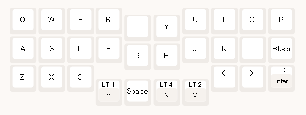
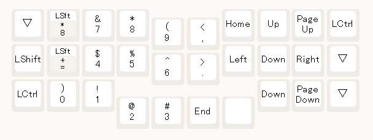
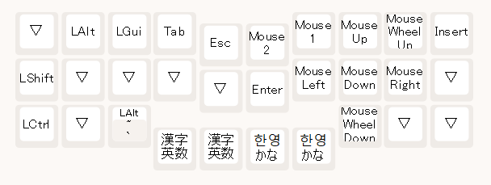
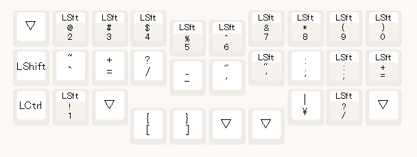
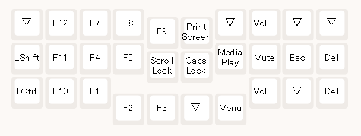

# キーマップについて
## 運指・キーレイヤーについて
ここからは、運指のはなしで、あくまで私の考えるおすすめの方法、ということで、人それぞれ使いやすい方法があると思います。

まずは基本レイヤー(レイヤー0)です。

3行目「V」と「M」のキーを親指のホームポジションとして指を添えておき、この間の4つのキーは基本親指で文字入力をします。

基本レイヤーには、26個のうち25個のアルファベットと、スペース、バックスペース、エンター、カンマ、ピリオドが配置してあります。25と言ったのは、使用頻度のやや低い「B」を、よく使う「スペース」と入れ替えているからです。

代わりに「B」は、「スペースとFの同時押し」で入力します。これにはCombo機能の設定が必要です。(後述)

そして、「M」を右親指で長押しすると、移動・数字レイヤー(レイヤー1)に入り、その他の右手指は自然とカーソル移動キーに乗っていると思います。

数字入力は左手でのテンキー配列です。

また、左親指を「V」に乗せると、モディファイアー・レイヤー(レイヤー1)に入り、その左手でwin,ctrl,shift,alt,tabにアクセスできます。

ここまでがおすすめレイヤーで、他に初期割り当てされているのは、記号レイヤーと、Functionレイヤーです。

記号レイヤー(レイヤー4)

Functionレイヤー(レイヤー3)

Esc,Delも設定されていますか、お好みで変更してください。

## アルファベットキーをレイヤーキーにするデメリット(と解決法)
これははっきりしていて、日本語文にせよ英文にせよ、連続している2つのキーのうち最初の1キーがレイヤーキー兼用だった場合、レイヤー切り替えと判定されて、2文字目が誤入力されてしまうことがあります。

Vialでの設定の「Tapping Term」によって、ホールド(レイヤー切り替え)と見なされる時間の長さを設定することで、このタイミングを調整することはできますが、この値が小さすぎると今度は十分長い時間長押ししないとレイヤー切り替えと見なされなくなり、素早く入力することが難しくなります。

レイヤー切り替えを、切り替え専用のキーに割り当てできれば、このようなことは起きないのですが、いかんせんキー数に余裕がないキーボードの場合、それは難しいです。

ただ、解決策という程のことではないですが、だんだん慣れてくると、連続する2キーの入力をする際のオーバーラップしている時間が、十分短くなってきて、誤入力がほとんど起きないようになってきました。私自身の個人的感想になりますが、人間の適応力によってある程度このデメリットはカバーされるのだと思いました。

## 日本語変換について
Windows PCで、キーボードの設定が「英語キーボード」になっている場合を前提にお話します。この話題は一般的な話なので、詳しい解説がWebに沢山あります。ここではごく簡単に説明します。

基本の日本語・英語入力の切り替えは「Alt+`」による切り替えです。

その他、PCの設定にもよりますが、英語入力と日本語入力それぞれの切り替えをOnOffのトグルではなく、それぞれ独立したキーに割り振ることが可能で、レイヤー1の親指付近に割り振りをするのが良いと思います。標準のキーマップを参考にして下さい。

## Combo機能の設定
おすすめのCombo機能の設定です。同時押しすることで入力される文字を設定します。

ShiftやCtrlなどのモディファイアーや、Spaceを割り振ることで足りなくなった「B」キー(使用頻度の低めのキーならよいので、お好みで割り振って下さい)の代替の同氏押し入力などを設定します。また数字レイヤーで、テンキーの近くに置く場所がなくなってしまった「-」「/」を割り当てています。

|キー1|キー2|キー3|出力されるキー|備考|
|:---:|:---:|:---:|:---:|---|
|Space|F||B|Bの位置にSPACEを割り当てている場合|
|A|S||L-Shift||
|Z|X||L-Ctrl||
|A|Z||LCS()|左Ctrl+Shift|
|K|L||R-Shift||
|,|.||R-Ctrl||
|LSft(8)|7||/|数字レイヤー(レイヤー2)で、*とその右隣の7を同時押しで/を入力|
|LSft(=)|4||-|数字レイヤー(レイヤー2)で、+とその右隣の4を同時押しで-を入力|
