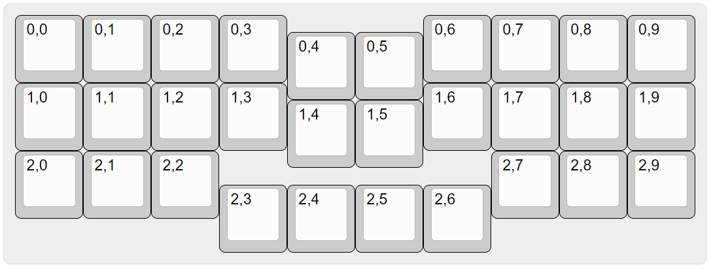

# このキーボードの配列について
最近自作キーボードの世界では(私の観測範囲の話ですが)40%キーボードが大変人気のようで、3行×10列プラス左右のモディファイアーキー(Tab、Shift、CtrlやBackspaceなど)、最下行にレイヤーやEnter、Spaceなどの役目のキーを加えたレイアウトが一般的なようです。

物理配列としては、ロースタッガード、カラムスタッガード、オルソリニアを中心に様々な形式があります。

さらにキーを減らした30%キーボードになると、左右端の一列ずつを削った形式が多いようです。この時点でアルファベット26文字を打つための3行×10列の30キープラス最下行の数個のキーが残っていますが、この最下行を削った、30キーのキーボードがいくつかあるようです。

< img src="images/3-10ortho.png" width="50%" />

これ以上キーを減らすにはアルファベット26文字を打つのにもレイヤーの切り替えが必要となるので、26～30キーが現実的には最小限のキー数だと感じています(確かに、これより少ないキー数のキーボードも存在していますし、私も過去に20キーのキーボード([1](../pengo20),[2](../penpen20))を作りました！)

世に存在する30キーのオルソリニア配列のキーボードに触れてみて思うのは、親指が活用しづらいのではないか、ということです。

一般的なキーボードの場合、QAZの3行は親指を除いた4指で打鍵するのが一般的で、親指がやや下方から生えていることからも合理的なことです。親指でこの3行のキーを打とうとすると、やや上向きに指を伸ばして打つようになり、繰り返し打つのが辛いと感じます(あくまで個人的な感想です)。

ならば、親指で操作したい、レイヤーキーを少し下方へずらしたらどうか、という発想でこの配列を作りました。

## キーマップについて
おすすめCombo
|キー1|キー2|キー3|出力されるキー|備考|
|:---:|:---:|:---:|:---:|---|
|Space|F||B|Bの位置にSPACEを割り当てている場合|
|A|S||L-Shift||
|Z|X||L-Ctrl||
|A|Z||LCS()|左Ctrl+Shift|
|K|L||R-Shift||
|,|.||R-Ctrl||
|LSft(8)|7||/|数字レイヤー(レイヤー2)で、*とその右隣の7を同時押しで/を入力|
|LSft(=)|4||-|数字レイヤー(レイヤー2)で、+とその右隣の4を同時押しで-を入力|
