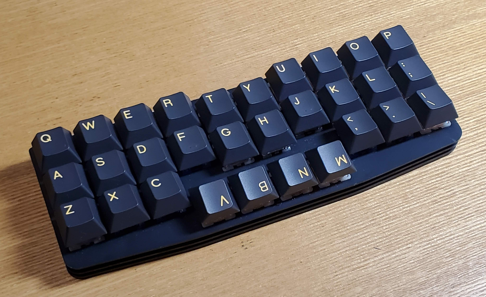

## 《3行×10列親指ずらし配列キーボード》「Dolphin30」ガイド

[このキーボードの配列について](../../dolphin30/layout.md)

このキーボードを設計した動機について説明します。

[キーマップについて](keymap.md)

このキーボードの実際の使い勝手・使い方について説明します。

[ビルドガイド](build.md) (作成途中)

このキーボードの作成手順です。

[ファームウェア](firmware.md) (作製中)

このキーボードのファームウェアが置いてあります。
