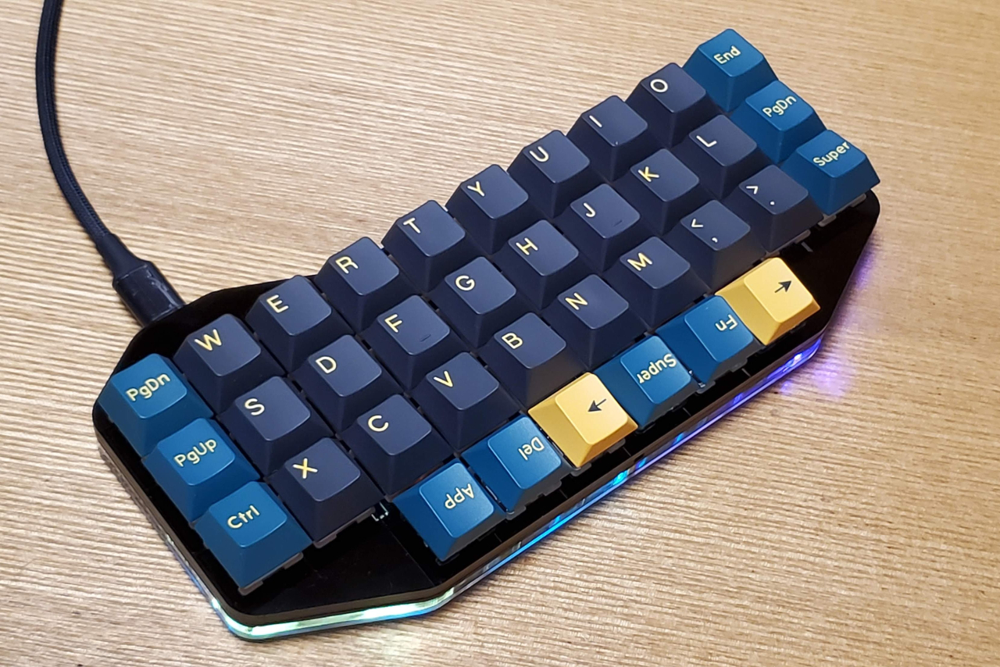

# Dolphin36

### 基板およびアクリルパーツ
|パーツ名|仕様|備考|
|:---|:---|:---|
|基板|FR4 1.6mm||
|スイッチプレート|アクリル3mm||
|ミドルプレート1|アクリル2mm|基板の直上|
|ミドルプレート2|アクリル5mm|基板の直下|
|ボトムプレート|アクリル2mm||
|ボトムカバープレート|FR4 0.8mm|コントローラのカバー|
### 必要パーツ

|パーツ名|備考|個数|
|:---|:---|---:|
|M2ネジ|3mm|22|
|M2スペーサー|5mm|11|
|タクトスイッチ|TS-1136-4.3|1|
|LED|SK6812MINI-E|36|
|ダイオード|SMD|36|
|kailhソケット||36|
|ProMicro|type-C|1|
|コンスルー|3.5mm|1|
|キースイッチ|MX互換|36|
|キーキャップ|MX互換|36|
