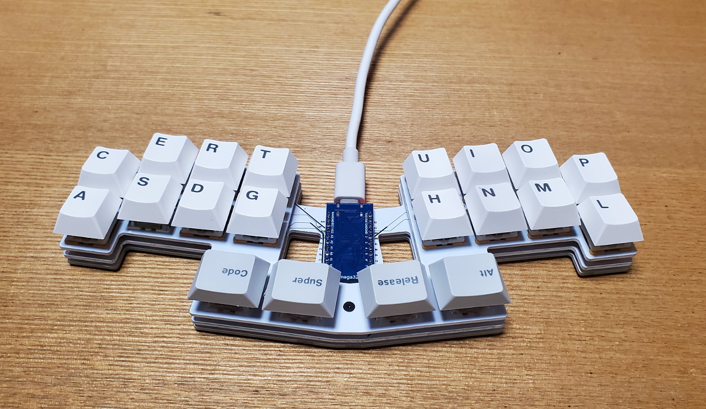

# Pengo20

### 基板およびアクリルパーツ
|パーツ名|仕様|備考|
|:---|:---|:---|
|基板|FR4 1.6mm||
|スイッチプレート|FR4 1.6mm||
|ボトムプレート|FR4 1.6mm||

### 必要パーツ

|パーツ名|備考|個数|
|:---|:---|---:|
|M2ネジ|3mm|14|
|M2スペーサー|7mm|7|
|タクトスイッチ|TS-1136-4.3|1|
|LED|SK6812MINI-E|20|
|ダイオード|SMD|20|
|kailhソケット||20|
|ProMicro|type-C|1|
|コンスルー|2.5mm|1|
|キースイッチ|MX互換|20|
|キーキャップ|MX互換|20|

### 組み立て方
- LED(つけなくてもOK)、ダイオード、タクトスイッチ、kailhソケットを基板に半田付け
- コンスルー(向きに注意)をProMicroに差し、基板に差しこんでProMicro側を半田付け
- Remapを開いて、[Pengo20](https://remap-keys.app/catalog/NtWGzE0zA4201EqOwXhT)のファームウェアを書き込む(FLASH)。同じページにPengo20とPenpen20、それぞれの英・日それぞれに適したファームがおいてあるので、該当のものを書き込む
- LEDの点灯を確認、各キーの反応をRemapのKeyMatrixなどで確認
- トッププレートにキースイッチをいくつか差し込み(この時点では、しっかりとは固定されません)、基板にスイッチを固定する。トッププレートには裏表があるので、ネジ穴の位置などで確認。
- 残りのスイッチを差し込む。
- スペーサーを表からネジでトッププレートに固定し、最後に裏からボトムプレートに固定する。
- キーキャップを取り付けて完成。
