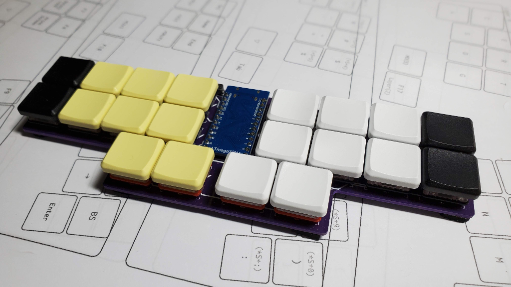

# Penpen20m

### 基板およびアクリルパーツ
|パーツ名|仕様|備考|
|:---|:---|:---|
|基板|FR4 1.6mm||

### 必要パーツ
|パーツ名|備考|個数|
|:---|:---|---:|
|タクトスイッチ|TS-1136-4.3|1|
|LED|WS2812B|3|
|ダイオード|SMD|20|
|chocソケット||20|
|ProMicro|type-C|1|
|コンスルー|2.5mm|1|
|キースイッチ|choc v1|20|
|キーキャップ|18mm×17mm対応のもの|20|

### 組み立て方
- ダイオード、タクトスイッチ、chocソケットを基板に半田付け
- アンダーグローLEDは取り付けても、下に隙間が十分ないので、効果薄い、取り付け非推奨。
- コンスルー(向きに注意)をProMicroに差し、基板に差しこんでProMicro側を半田付け
- Remapを開いて、[Pengo20](https://remap-keys.app/catalog/NtWGzE0zA4201EqOwXhT)のファームウェアを書き込む(FLASH)。同じページにPengo20とPenpen20、それぞれの英・日それぞれに適したファームがおいてあるので、該当のものを書き込む
- LEDの点灯を確認、各キーの反応をRemapのKeyMatrixなどで確認
- 基板にスイッチを固定する。
- キーキャップを取り付けて完成。
